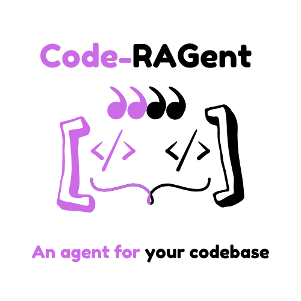
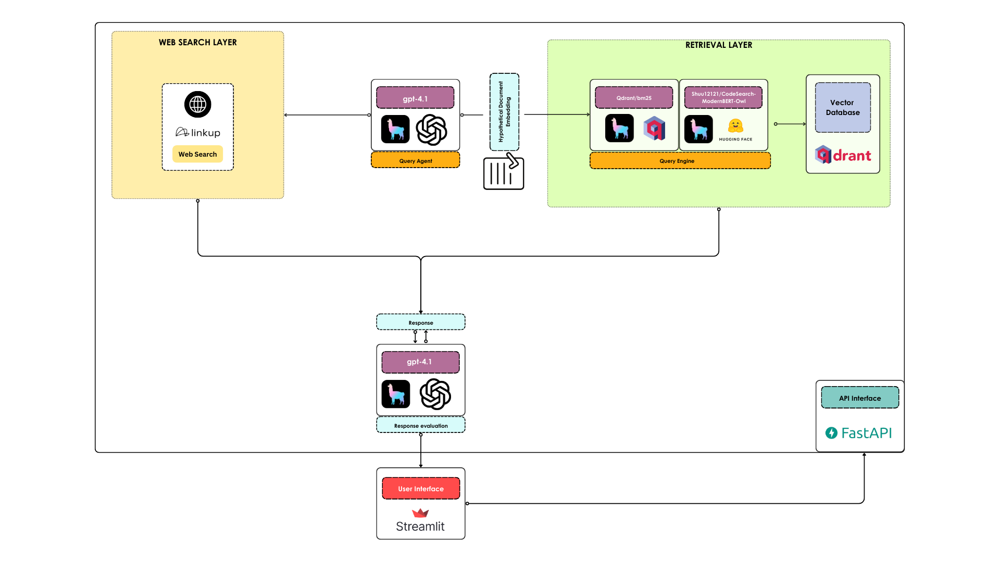

<h1 align="center">Code-RAGent</h1>

<h2 align="center">An agent for your codebase💻</h2>

<div align="center">
    <h3>If you find Code-RAGent useful, please consider to donate and support the project:</h3>
    <a href="https://github.com/sponsors/AstraBert"></a>
</div>
<br>
<div align="center">
    
</div>
<br>

Code-RAGent is your friendly coded assistant based on your personal codebases and grounded in web search. It is built on top of GPT-4.1, powered by [OpenAI](https://openai.com), [LinkUp](https://linkup.so), [LlamaIndex](https://www.llamaindex.ai), [Qdrant](https://qdrant.tech), [FastAPI](https://fastapi.tiangolo.com) and [Streamlit](https://streamlit.io).

## Install and launch🚀

> _Required: [Docker](https://docs.docker.com/desktop/) and [docker compose](https://docs.docker.com/compose/)_

The first step, common to both the Docker and the source code setup approaches, is to clone the repository and access it:

```bash
git clone https://github.com/AstraBert/code-ragent.git
cd llama-4-researcher
```

Once there, you can follow this approach

- Add the `openai_api_key` and `linkup_api_key` variable in the [`.env.example`](./.env.example) file and modify the name of the file to `.env`. Get these keys:
    + [On OpenAI Platform](https://platform.openai.com/api-keys)
    + [On Linkup Dashboard](https://app.linkup.so/api-keys)

```bash
mv .env.example .env
```

- You can now launch the containers with the following commands:

```bash
docker compose up qdrant -d
docker compose up backend -d
docker compose up frontend -d
```

You will see the application running on http://localhost:8501. Depending on your connection and on your hardware, the set up might take some time (up to 15 mins to set up) - but this is only for the first time your run it!

## How it works

### Database services

- **Qdrant** is used to store vectors coming from the ingestion of the codebase 


### Workflow



- First step, which is run only the first time you launch the `backend` container, is to download [my `learning-go` repository](https://github.com/AstraBert/learning-go) (that contains my solutions to [Exercism Go Problems](https://exercism.org)) and ingest it using the `IngestCode` functionality of [ingest-anything](https://pdfitdown.eu/built-with-pdfitdown/ingest-anything), powered by [Chonkie's `CodeChunker`](https://chonkie.mintlify.app/chunkers/code-chunker) and the Sentence Transformers model [`Shuu12121/CodeSearch-ModernBERT-Owl`](https://huggingface.co/Shuu12121/CodeSearch-ModernBERT-Owl). 

>[!NOTE]
>_You can customize this step to ingest **your** code just by modifying the [data.py](./data.py) script_

- Once the Qdrant vector database has been set up in the first step, we connect our Code-RAGent with it, as well as with the web (through [Linkup](https://linkup.so))
- The agent routes your query either to the vector search tool, expanding the query into an hypothetical document embedding prior to hybrid search, or to the web search tool. The agent can also reply directly, if the question is very simple.
- Once the agent produced the answer, it can evaluate it for correctness, faithfulness and relevancy, leveraging [LlamaIndex evaluators](https://docs.llamaindex.ai/en/stable/optimizing/evaluation/evaluation/). 

## Contributing

Contributions are always welcome! Follow the contributions guidelines reported [here](CONTRIBUTING.md).

## License and rights of usage

The software is provided under MIT [license](./LICENSE).
